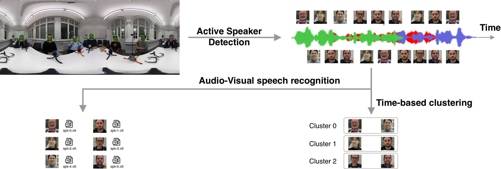

The baseline system is provided at [Github](#). Please refer to the README therein for information about how to install and run the system.

Baseline system:

- Active Speaker Detection: This module determines which speaker is actively speaking at any given moment. Baseline model: [A Light Weight Model for Active Speaker Detection](https://github.com/Junhua-Liao/Light-ASD).
- Audio-Visual speech recognition model: This module combines audio and visual cues to transcribe speech into text. Baseline model: [Cocktail-Party Audio-Visual Speech Recognition](#)
- Time-based clustering:
    - For each pair of speakers, calculating a "conversation score" based on speaking time overlaps:
        - If speakers talk at the same time (overlap), they're less likely to be in the same conversation
        - If speakers talk at different times (non-overlap), they're more likely to be in the same conversation
        - The score is calculated as: 1 - (overlap_duration / total_duration)
    - The scores are converted into a distance matrix where:
        - Higher scores (less overlap) = smaller distances = more likely to be in same conversation
        - Lower scores (more overlap) = larger distances = less likely to be in same conversation
    - Agglomerative Clustering used for grouping speakers.
