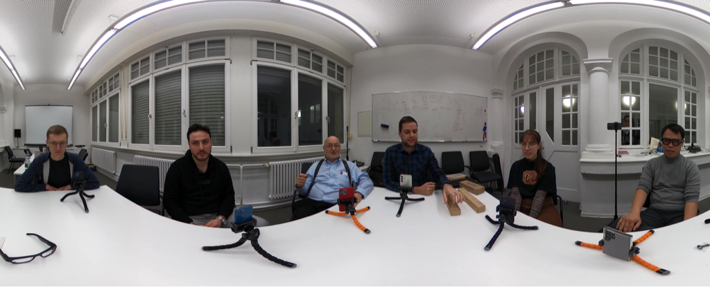

The [MCoRec dataset](#) contains video recording sessions. A single recording session typically features multiple conversations, each involving two or more participants. A 360° camera, placed in the middle of the room, captures the central view which contains all participants. The audio for the sessions is also captured by the microphone integrated into the 360° camera. Each session can involve a maximum of 8 active speakers and up to 4 simultaneous conversations. With multiple concurrent discussions, the speech overlap ratio in the mixed audio can reach 100%. The image below shows an example of a recording session with 6 participants engaged in 3 separate conversations, each consisting of 2 speakers.



The MCoRec dataset consists of 56 recordings for training (released on July 1th 2025), 25 recordings for development (released on July 1th 2025) and 69 recordings for evaluation (will be released on #TBU). 

**Important**: All facial data in the MCoRec dataset is provided with clear, unblurred facial views to enable face-based analysis and recognition tasks.

**Privacy Notice**: While faces are unblurred in the dataset for research purposes, any public presentations, publications, or demonstrations must not display speaker faces without explicit permission from the dataset authors for privacy protection.

Here is some statistic number of MCoRec dataset. 

|             | # sessions | # conversations | duration | session's duration | # speakers   | # speakers per conversation   | # conversations per session   |
| ----------- | :---------:| :-------------: | :------: | :----------------: | :----------: | :---------------------------: | :---------------------------: |
| train       | 56         |        120      |   5.6 h  |        6 min       |      20      |           2 - 4               |           1 - 4               |
| dev         | 25         |        60       |   2.5 h  |        6 min       |      12      |           2 - 4               |           1 - 4               |
| eval        | 69         |        157      |   6.9 h  |        6 min       |      24      |           2 - 4               |           1 - 4               |

### Training Set

For the training set, beyond the central view, each speaker is also recorded using a smartphone. This smartphone, placed close to and in front of the speaker for a clear facial view, captures an additional video stream. It also records audio from an attached close-talking lapel microphone. This additional egocentric data is provided only for the training set to facilitate system development.

### Development and Evaluation Sets

The participants can use the development set to evaluating model performance during system development. It can be used to select the best model checkpoint, tune hyperparameters, and compare different system configurations. However, the dev set must not be used to train the model or update its internal parameters in any way.


**Important Note**: The smartphone recordings (egocentric videos and close-talking audio from lapel microphones) are **only available for the training set**. The development and evaluation sets contain **only the central 360° video and audio** captured by the central camera.

Note that the number of people show in the central view can be more than the number of paticipants which need to be processed. The target participants will be provided by the bbox.

## Detailed desciption of data structure and formats

The directory structure is as follows:
```
Example of session with 4 speakers separated into 2 conversations.

session_id
├── central_video.mp4
├── metadata.json
├── labels # Only provided in the train and dev set
│   ├── speaker_to_cluster.json
│   ├── spk_0.vtt
│   ├── spk_1.vtt
│   ├── spk_2.vtt
│   └── spk_3.vtt
└── speakers
    ├── spk_0
    ├── spk_1
    │   ├── central_crops
    │   │   ├── track_00_bbox.json
    │   │   ├── track_00.json
    │   │   ├── track_00.mp4
    │   │   ├── track_01_bbox.json
    │   │   ├── track_01.json
    │   │   └── track_01.mp4
    │   ├── ego_crops # Only provided in the train set
    │   │   ├── track_00_bbox.json
    │   │   ├── track_00.json
    │   │   └── track_00.mp4
    │   └── ego_video.mp4
    ├── spk_2
    └── spk_3
```

- Each recording session is contained within a directory named with a unique `session_id`

- `central_video.mp4`: This is the main video file for the session, captured by the 360° camera placed in the center of the room. It provides a view of all individuals present.
  
  - Audio: single channel (from the 360 camera's microphone), 16kHz
  - Video: 4K, 25fps.

- `speakers/`: This directory contains subdirectories for each individual target participant (e.g., `spk_0, spk_1, ... spk_N`) who needs to be processed in the session.

- `central_crops/`: This folder contains data derived from the `central_video.mp4` specifically for a speaker. It contains multiple tracks, all from the same speaker but in different timelines. The multiple tracks exist because face recognition is performed first to detect and track faces throughout the video. In some cases, frames may be miss-predicted during face recognition, causing the speaker's face tracking to be split into separate temporal segments, resulting in multiple tracks (where `xx` represents the track number: 00, 01, 02, etc.).
  - `track_xx.mp4`: These are 224x224 face crop videos of the speaker, where `xx` is the track number. Technical specifications:
    - Video: H264 (MPEG-4 AVC), 224x224 resolution, 25fps
    - Audio: MPEG AAC Audio (mp4a), 16kHz sample rate, 32 bits per sample
  - `track_xx_bbox.json`: Stores bounding-box points. Each entry uses the frame number (as a string) to map to a bounding box specification. Example:

    ```json
    { 
      "0": { "x1": 3893.5127, "y1": 910.7231, "x2": 4024.8086, "y2": 1088.9075},     
      "1": { "x1": 3893.5127, "y1": 910.7231, "x2": 4024.8086, "y2": 1088.9075},
      "...": { /* additional frames */ }
    }
    ```
  - `track_xx.json`: Contain the metadata of the track like start-end time/frame of the track, track duration Example:

    ```json
    {
        "frame_start": 0,
        "frame_end": 10996,
        "start_time": 0.0,
        "end_time": 439.84,
        "duration": 439.84
    }
    ```

- `ego_crops/`: This subfolder is only provided in the training set. It contains data derived from the egocentric video (e.g., `ego_video.mp4`) captured by the speaker's phone. The source `ego_video.mp4`, captured by the speaker's smartphone, includes an audio track (single channel 16kHz) recorded by a lapel microphone that was connected to the smartphone and positioned close to the speaker's mouth for enhanced audio clarity. The file structure and formats within `ego_crops/` are identical to those found in the `central_crops/` folder.

- `labels/`: This subfolder is only provided in the train and dev set. It contains the ground truth information for the session.
  - `speaker_to_cluster.json`: This file likely maps each speaker ID (e.g., spk_0, spk_1) to a conversation cluster or group ID. This helps in identifying which speakers are part of the same conversation within the session, as one session can feature multiple distinct conversations. Example:
    ```json
    {
        "spk_0": 0,
        "spk_1": 0,
        "spk_2": 1,
        "spk_3": 1,
        "spk_4": 2,
        "spk_5": 2
    }
    ```  

  - `spk_0.vtt, spk_1.vtt, ... spk_N.vtt`: These are WebVTT (Web Video Text Tracks) files, one for each target speaker in the session (identified as spk_0, spk_1, etc.). Each .vtt file contains the time-stamped transcriptions of the speech for that specific speaker. Example:
    ```webvtt
    WEBVTT

    00:00:03.500 --> 00:00:05.200
    Hello everyone,

    00:00:06.000 --> 00:00:08.300
    Welcome to the meeting.
    ```

    The .vtt files provide detailed transcriptions of the spoken content. In addition to lexical words, these include annotations for various vocal events such as hesitations (e.g., 'um', 'uh'), laughter (e.g., 'haha', 'hehe'), exclamations, and specific interjections or backchannels (e.g., 'ah', 'oh', 'wow'). Please note that these annotated vocal events will be automatically removed by the official evaluation script before Word Error Rate calculation.


- `metadata.json`: 

  ```json
  {
    "spk_0": {...},
    "spk_1": {
        "ego": { # Only provided in the train set
            "video": "speakers/spk_0/ego_video.mp4",
            "uem": {
                "start": 5.6545,
                "end": 367.8575
            },
            "crops": [
                {
                    "video": "speakers/spk_0/ego_crops/track_00.mp4",
                    "crop_metadata": "speakers/spk_0/ego_crops/track_00.json",
                    "bbox": "speakers/spk_0/ego_crops/track_00_bbox.json"
                }
            ]
        },
        "central": {
            "video": "central_video.mp4",
            "uem": {
                "start": 11.6017,
                "end": 373.8117
            },
            "crops": [
                {
                    "video": "speakers/spk_0/central_crops/track_00.mp4",
                    "crop_metadata": "speakers/spk_0/central_crops/track_00.json",
                    "bbox": "speakers/spk_0/central_crops/track_00_bbox.json"
                },
                {
                    "video": "speakers/spk_0/central_crops/track_01.mp4",
                    "crop_metadata": "speakers/spk_0/central_crops/track_01.json",
                    "bbox": "speakers/spk_0/central_crops/track_01_bbox.json"
                }
            ]
        }
    },
    "spk_2": {...},
    "spk_3": {...},
    "spk_4": {...},
    "spk_5": {...}
  }
  ```

  - Each speaker-specific object contains detailed information about their associated data from both `ego` and `central` views. Note: `ego` only provided in the train set.

  - `uem`: An object with `start` and `end` attributes (in seconds), marking the beginning and end of the primary conversation within the recording.

- The `central_video.mp4`, `ego_video.mp4` (if provied) videos and derived face crops (`central_crops/`, `ego_crops/`) are provided with clear, unblurred facial views of the target participants. 

## Getting the data

- MCoRec-Train:
  - [train_only_central_videos.zip \[~46GB\]](https://huggingface.co/datasets/MCoRecChallenge/MCoRec/resolve/main/train_only_central_videos.zip)
  - [train_without_central_videos.zip \[~36.2GB\]](https://huggingface.co/datasets/MCoRecChallenge/MCoRec/resolve/main/train_without_central_videos.zip)

- MCoRec-Dev:
  - [dev_only_central_videos.zip \[~20.6GB\]](https://huggingface.co/datasets/MCoRecChallenge/MCoRec/resolve/main/dev_only_central_videos.zip)
  - [dev_without_central_videos.zip \[~6.12GB\]](https://huggingface.co/datasets/MCoRecChallenge/MCoRec/resolve/main/dev_without_central_videos.zip)

- MCoRec-Eval:
  - [eval_only_central_videos.zip \[~50GB\]](#)
  - [eval_without_central_videos.zip \[~10GB\]](#)

For obtaining the the MCoRec dataset, you first need to request access and then download it using your Hugging Face token. Please note that access requires signing a Data Use Agreement (DUA). This DUA stipulates that the data must not be further distributed to any individuals or entities who have not also signed the agreement. #TBU DUA 

-  **Request Access:**
    - Go to the [MCoRec dataset repository](https://huggingface.co/datasets/MCoRecChallenge/MCoRec) on Hugging Face.
    - Request access to the dataset. You will need a Hugging Face account.

-  **Get Your Hugging Face Token:**

    If you don't have one, create a Hugging Face User Access Token. Follow the instructions [here](https://huggingface.co/docs/hub/security-tokens) to obtain your `HF_TOKEN`. Make sure it has read permissions.

-  **Download and Unzip Dataset Files:**

    It's recommended to download and unzip the data into a `data-bin` directory within your `mcorec_baseline` project folder.

```sh
# Navigate to your baseline project directory if you aren't already there
# cd mcorec_baseline 

# Create a data directory (if it doesn't exist)
mkdir -p data-bin
cd data-bin

# Export your Hugging Face token (replace 'your_actual_token_here' with your actual token)
export HF_TOKEN=your_actual_token_here

# Download the development set
wget --header="Authorization: Bearer $HF_TOKEN" https://huggingface.co/datasets/MCoRecChallenge/MCoRec/resolve/main/dev_without_central_videos.zip

# Unzip the downloaded files
unzip dev_without_central_videos.zip

# Download the train set TBU
# Download the evaluation set TBU
```