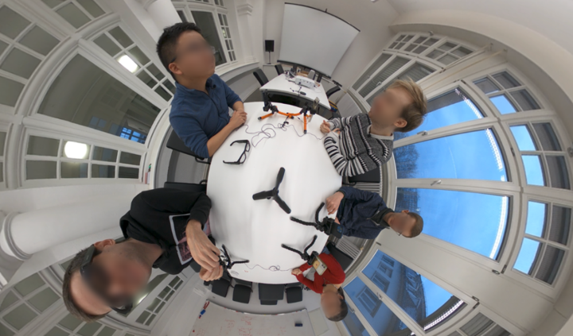
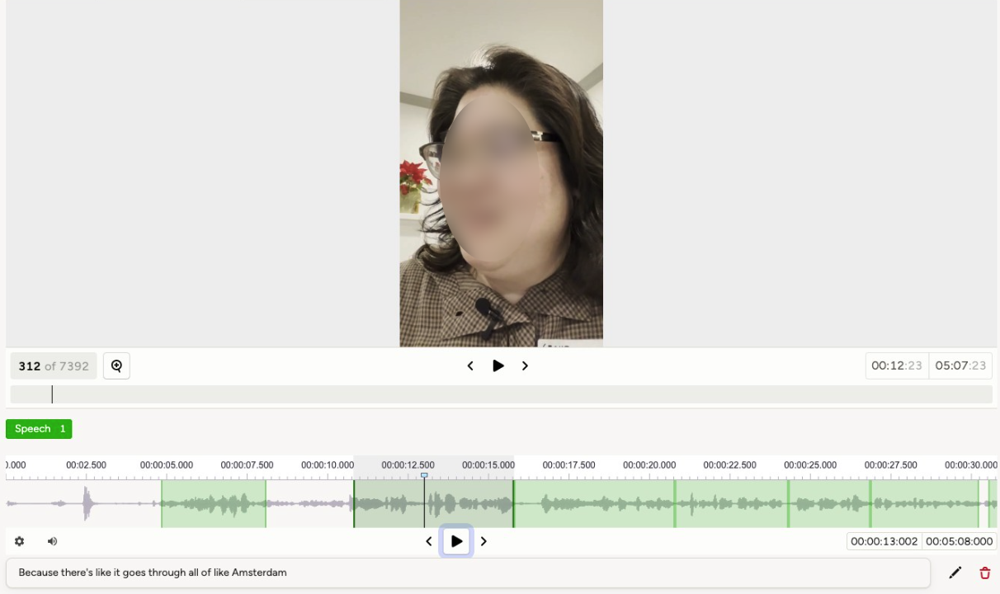
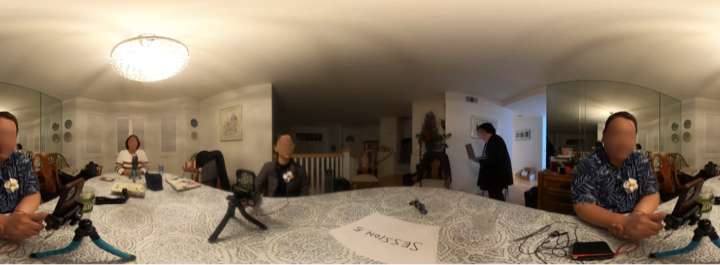

## Data collection

### Topics and Speakers

- Conversation Topics: Everyday life & hobbies, work & school, hypotheticals, entertainment, news, and personal stories.

- Participants per Session: 2 to 8 speakers, divided into groups of 2–4 participants.

### Recording Devices

- GoPro Max 360 (4K resolution)
- Smartphones (720p resolution)
- Lapel Microphones (connected via adapter to smartphones)

### Layout and Setup

- Recording Environments: Data was collected across approximately 10 different rooms of varying sizes and types, including living rooms, meeting rooms, lecture halls, and other indoor spaces.

- Seating Arrangement: All speakers sit around a table; distances vary by table size (around 2 to 5 meters).

- Smartphone Placement: Each speaker has a smartphone in front (selfie mode) with a lapel mic clipped near the mouth.

- 360° Capture: A GoPro Max mounted at the center of the table captures all participants.

- Session Markers: Moderator signals start and end with a distinctive whistle.

## Annotation

### Signal Alignment

To synchronize recordings from multiple devices, we use the moderator’s whistle cue in a two-step process:

- Manual Annotation: Listen to each audio track and mark the start/end regions containing the whistle.

    

- Automatic Detection: Compute the spectral-flux onset strength envelope with librosa.onset.onset_strength, then identify the timestamp of the highest peak to pinpoint the exact whistle moment.

### Transcription Workflow

High-quality audio from smartphones and lapel mics is used for transcription

- Automatic Transcript: Run each clip through the Whisper-large-v2 model.

- Post-Editing: Annotators use Label Studio to:
    - Adjust segment boundaries to isolate the target speaker’s speech.
    - Correct transcript text for accuracy.

    

### 360° Video Processing

Frame Padding for Horizon Artifacts

- When a speaker straddles the image boundary, their face can split across the frame

    

- We resolve this by padding each frame: append 20% of the left edge to the right side, creating a continuous panorama.

    

- Face Recognition and Linking:
    - Face Detection: Run the padded 360° videos through a face-recognition pipeline to extract face crops.

    - Manual Association: Link each face crop from the 360° feed to the corresponding smartphone video of the same speaker.

    

